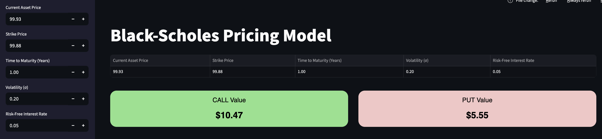
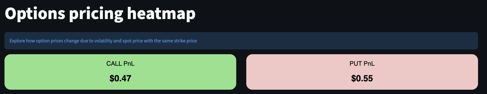
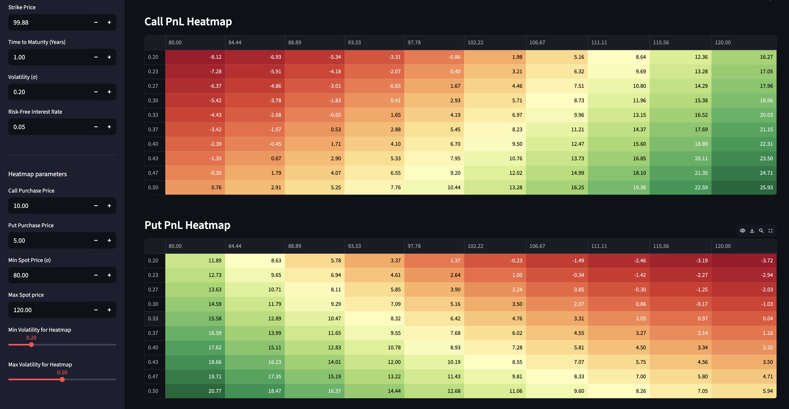

# Black Scholes
A mini project regarding the black scholes model

## dependencies
streamlit
 pandas
 numpy
 math
 scipy
 matplotlib

## steps 
python -m vevnv .venv
 source .venv/bin/activate
 download the dependencies
 streamlit run landing.py
 to deactivate the env: deactivate

## Black scholes options model images (without pnl)

## Black scholes option pricing heat map (pnl)

This heatmap shows the pnl given a range of spot prices and volatilty with a set strike price. In this example, the spot price range is 80 to 120. The volatility range is 0.2 to 0.5. The strike price is 99.88. Let's take the first row and column for the call heatmap, it shows the value -8.12. This means that based on black scholes model, the fair price for the option is 1.88 due to the volatility and spot price, however we paid 10 for the it. This means that we lost 8.12 on this trade.

# Details
## Author
- Harris Ilhan Bin Ahmad Affandi
